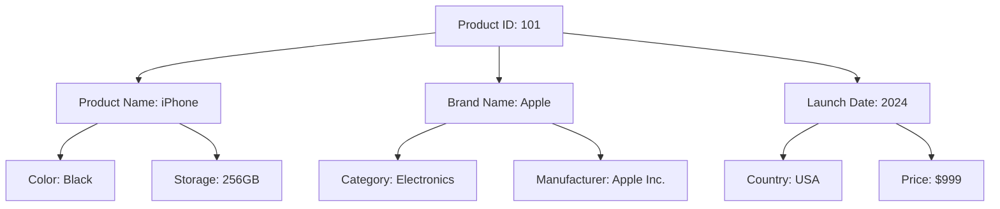
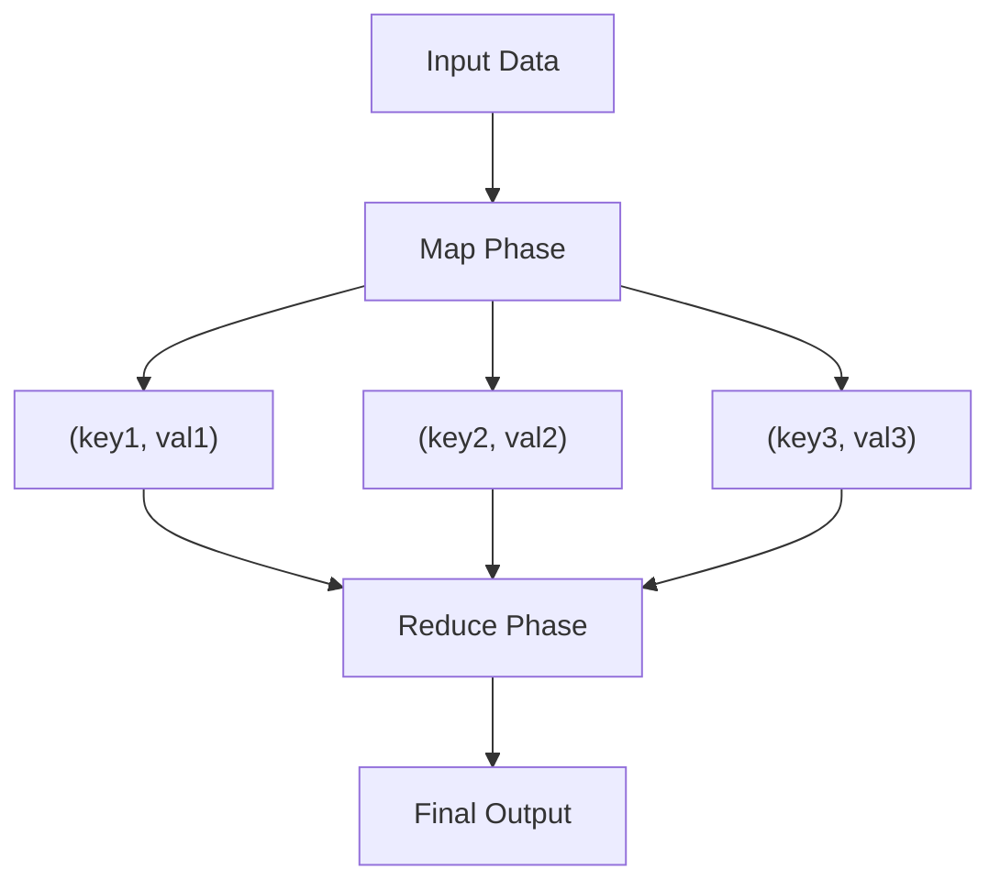

# Part 1: Foundations of Data Systems

Chapter 1: Reliability, Scalability, and Maintainability

| **Aspect** | **Definition** | **Key Challenges** | **Common Solutions** |
| --- | --- | --- | --- |
| Reliability | System continues to work correctly even when things go wrong | Hardware faults, Software errors, Human errors | Redundancy, Fault tolerance, Testing |
| Scalability | System's ability to handle growth in data, traffic, or complexity | Load handling, Performance degradation, Resource limitations | Horizontal/Vertical scaling, Load balancing, Caching |
| Maintainability | Making system modifications and operations easier over time | Technical debt, System complexity, Knowledge transfer | Good documentation, Clean code, Modular design |

**Chapter 2: Data Models and Query Languages**

A data model is an abstract model that defines how data is organized, stored, and manipulated within a system. It serves as a blueprint for database design and determines the logical structure of data relationships.

Key aspects of data models include:

- **Structure:** How data elements are organized and related to each other
- **Constraints:** Rules that maintain data integrity and consistency
- **Operations:** Methods for accessing and updating the data

Common types of data models:

| **Model Type** | **Description** | **Example Use Cases** |
| --- | --- | --- |
| Relational | Data organized in tables with rows and columns | Traditional business applications, Banking systems |
| Document | Semi-structured data stored as documents | Content management, Catalogs |
| Graph | Data represented as nodes and edges | Social networks, Recommendation systems |
| Key-Value | Simple pairs of keys and values | Caching, Session management |
- JSON represents a single document, so one query is sufficient, and the JSON representation resembles a Tree Structure

This diagram illustrates the hierarchical nature of a document data model, where a single product entity contains nested attributes. The tree structure makes it easy to represent one-to-many relationships and nested data.

- Advantage of using ID, rather than just a text field, is that an ID never has to change, even if the information that it identifies changes.
    - This reduces write overheads, and inconsistencies
- The Network model
    - Data was similarly represented much like JSON documents, but a programmer would have to trace the route (much like a linked List) from the root node to the record of interest. If the record had many parents (One-to-Many), then the programmer still had to keep track of these different paths.
- Related items in both the document and relational scheme have document reference and foreign key, respectively.
- Arguments for both:
    - Document data model
        - Schema flexibility, better performance due to locality, for some applications it is closer to the data structure used by the application
    - Relational Model
        - Better support for joins, many-to-one and many-to-many relationships

## Schema-on-Write vs Schema-on-Read

These are two different approaches to handling data schema enforcement in databases:

| **Characteristic** | **Schema-on-Write** | **Schema-on-Read** |
| --- | --- | --- |
| When schema is enforced | At write time (data insertion) | At read time (data retrieval) |
| Typical in | Traditional relational databases | Document databases |
| Advantages | Data consistency guaranteed, Better query optimization | Schema flexibility, Faster writes |
| Disadvantages | Schema changes are slow, Less flexible | Data inconsistency possible, More complex reads |

Schema-on-write is like enforcing structure when you write in a traditional paper form - you must fill in all required fields in the correct format before submitting.

Schema-on-read is like writing on blank paper - you can write anything, but the structure is only enforced when someone needs to interpret (read) the data later.

- Schema-on-read is similar to dynamic (runtime) type checking in programming languages, wheras schema-on-write is similar to static (compile-time) type checking.

**Query Languages for Data**

A query language can be either imperative or declarative:

| **Query Language Type** | **Description** | **Characteristics** | **Examples** |
| --- | --- | --- | --- |
| Imperative | Tells the computer how to perform specific operations step by step | - Explicit control flow
- Specific instructions
- Performance depends on programmer's approach | - Traditional loops in programming
- Step-by-step data processing |
| Declarative | Specifies what results are needed without detailing how to get them | - Focus on end result
- Database optimizes execution
- Higher level of abstraction | - SQL
- CSS
- XSLT |

The key advantage of declarative languages is that they hide implementation details and make it easier for the database system to introduce performance improvements without changing queries.

**MapReduce Querying**

MapReduce is a programming model designed for processing and generating large datasets in parallel across distributed systems. It consists of two main operations:

- **Map:** Takes input data and converts it into key-value pairs, processing each record independently
- **Reduce:** Aggregates the results from the Map phase, combining all values associated with the same key

Key characteristics of MapReduce:

- Parallel processing capabilities
- Suitable for large-scale data processing
- Built-in fault tolerance
- Automatic distribution of work across nodes

While MapReduce was pioneering when introduced by Google, it has largely been superseded by more modern data processing frameworks like Apache Spark, which offer more flexibility and better performance for many use cases.

**Graph-Like Data Models**

- 

[Chapter 3: Storage and Retrieval](https://www.notion.so/Chapter-3-Storage-and-Retrieval-1d0c156ec56f805f8227c61f5231548f?pvs=21)